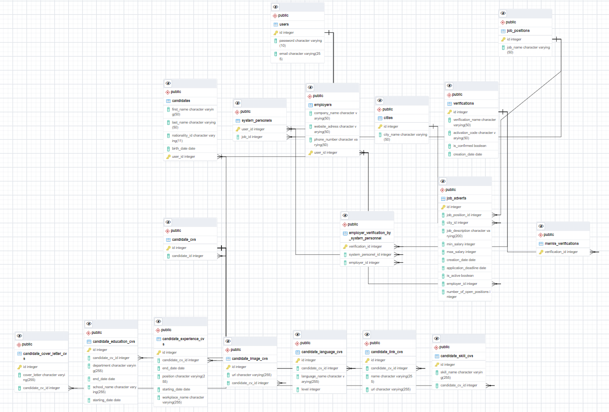

# HrmsProject

## About the project
Hrms is a human resources project that offers opportunities to candidates who want to have a job.

## Database Diagram

## Technologies used
- Java
- Spring Boot
- Spring Framework
- SpringFoxHibernate
- PostgreSql
- Cloudinary

## Features 
- Prepared with Java Programming language and Layered architecture ([Entities](https://github.com/zeynepsl/HrmsProject/tree/master/hrms/src/main/java/kodlamaio/hrms/entities),
[DataAccess](https://github.com/zeynepsl/HrmsProject/tree/master/hrms/src/main/java/kodlamaio/hrms/dataAccess/abstracts), 
[Business](https://github.com/zeynepsl/HrmsProject/tree/master/hrms/src/main/java/kodlamaio/hrms/business), 
[Core](https://github.com/zeynepsl/HrmsProject/tree/master/hrms/src/main/java/kodlamaio/hrms/core) and 
[WebAPI](https://github.com/zeynepsl/HrmsProject/tree/master/hrms/src/main/java/kodlamaio/hrms/api/controllers) layers).
- It brings together candidates and employers.
- Each method is provided to return a Result structure [result](https://github.com/zeynepsl/HrmsProject/tree/master/hrms/src/main/java/kodlamaio/hrms/core/utilities/results)
- Autowired in SpringFramework structure is used for IoC.
